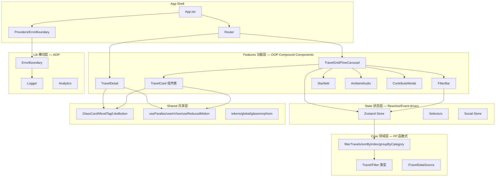
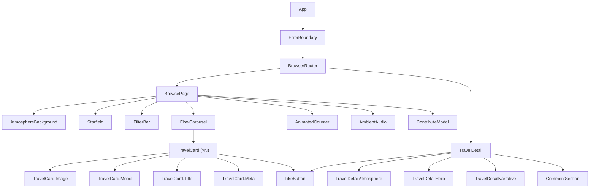
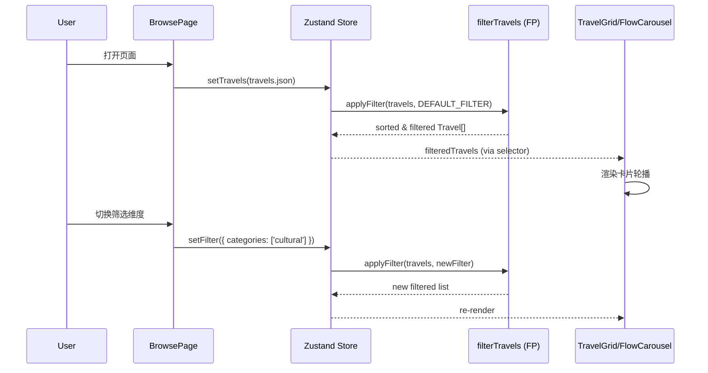
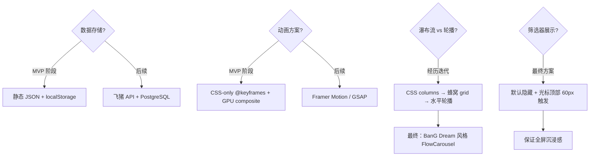

# 架构设计文档

> 对应源码：`src/` 下全部文件

---

## 1. 多范式融合架构



---

## 2. 范式映射

| 层 | 范式 | 核心特征 | 示例 |
|---|---|---|---|
| `core/` | **函数式编程** | 纯函数、不可变数据、谓词组合子、零副作用 | `applyFilter(travels, filter)` 返回新数组 |
| `features/` | **OOP Compound Components** | Context 驱动的子组件组合、接口隔离 | `<TravelCard.Image />` `<TravelCard.Mood />` |
| `state/` | **响应式/事件驱动** | Zustand selector 自动派生、UI 订阅状态 | `useFilteredTravels()` 自动重算 |
| `lib/` | **AOP 横切关注点** | ErrorBoundary 装饰器、分析埋点注入 | `analytics.cardClick()` 不侵入业务代码 |
| `shared/` | **工具包模式** | UI Kit + Hooks + Design Tokens，纯展示无业务逻辑 | `GlassCard`、`useParallax` |

---

## 3. 组件树



---

## 4. 数据流



---

## 5. 路由设计

| 路径 | 组件 | 说明 |
|---|---|---|
| `/` | Navigate | 重定向到 `/browse` |
| `/browse` | BrowsePage | 主浏览页 |
| `/browse/:id` | TravelDetail | 沉浸式详情页 |

---

## 6. 关键设计决策



---

## 7. 目录结构

```
flypig-100-travels/
├── index.html
├── package.json
├── tsconfig.json
├── vite.config.ts
├── .gitignore
├── README.md
├── docs/
│   ├── PRD.md
│   ├── ER-Diagram.md
│   ├── Architecture.md
│   └── API.md
├── scripts/
│   └── init-data.js          # 数据初始化脚本
├── src/
│   ├── main.tsx
│   ├── vite-env.d.ts
│   ├── app/
│   │   ├── App.tsx
│   │   ├── router.tsx
│   │   ├── providers.tsx
│   │   └── pages/
│   │       ├── BrowsePage.tsx
│   │       └── AtmosphereBackground.tsx
│   ├── core/
│   │   ├── domain/
│   │   │   ├── Travel.ts
│   │   │   └── Filter.ts
│   │   ├── transforms/
│   │   │   ├── filterTravels.ts
│   │   │   ├── sortByIndex.ts
│   │   │   └── groupByCategory.ts
│   │   └── ports/
│   │       └── ITravelDataSource.ts
│   ├── features/
│   │   ├── travel-card/
│   │   ├── filter-bar/
│   │   ├── travel-grid/
│   │   ├── travel-detail/
│   │   ├── ambient-audio/
│   │   ├── starfield/
│   │   └── contribute/
│   ├── state/
│   │   ├── store.ts
│   │   ├── selectors.ts
│   │   └── social.ts
│   ├── shared/
│   │   ├── components/
│   │   ├── hooks/
│   │   └── styles/
│   ├── lib/
│   │   ├── ErrorBoundary.tsx
│   │   ├── analytics.ts
│   │   └── logger.ts
│   └── data/
│       └── travels.json
└── src/__tests__/
    └── core/
        ├── filterTravels.test.ts
        ├── sortByIndex.test.ts
        └── groupByCategory.test.ts
```
