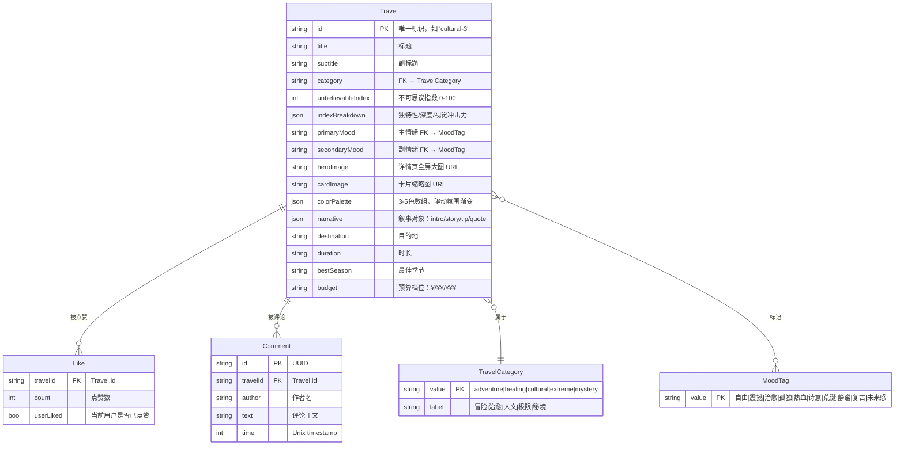
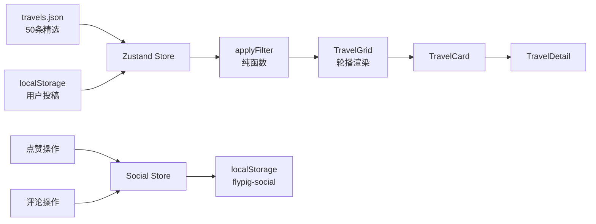

# 数据模型 & ER 图

> 对应源码：`src/core/domain/Travel.ts`、`src/core/domain/Filter.ts`、`src/state/social.ts`

---

## 实体关系图



---

## 数据存储策略

| 数据层 | 存储方式 | 说明 |
|---|---|---|
| 基础旅行数据 | `src/data/travels.json` | 50 条精选 + 用户投稿（localStorage） |
| 点赞数据 | `localStorage` (key: `flypig-social`) | 持久化在浏览器端 |
| 评论数据 | `localStorage` (key: `flypig-social`) | 持久化在浏览器端 |
| 用户投稿 | `localStorage` (key: `flypig-contributed`) | 与基础数据合并展示 |
| 筛选状态 | Zustand store（内存） | 会话级，不持久化 |

---

## 数据流



---

## 索引设计

由于当前为前端 MVP（静态 JSON），数据量 < 200 条，不使用数据库索引。

**后续接入飞猪 API 时的建议索引：**

```sql
-- 按类别筛选
CREATE INDEX idx_travel_category ON travels(category);

-- 按不可思议指数排序
CREATE INDEX idx_travel_unbelievable ON travels(unbelievable_index DESC);

-- 全文搜索
CREATE INDEX idx_travel_fts ON travels USING GIN(to_tsvector('chinese', title || ' ' || destination));
```
