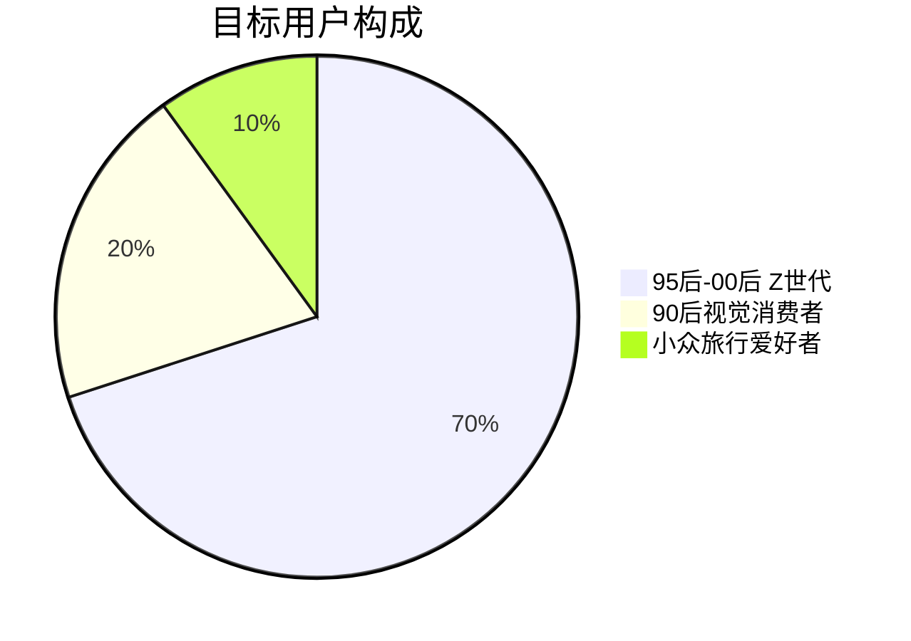
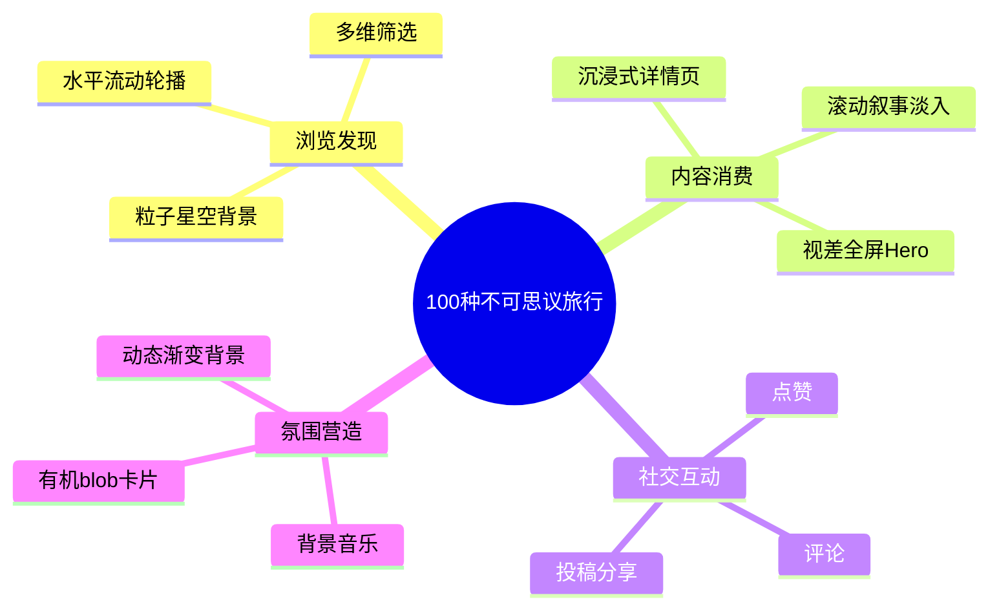
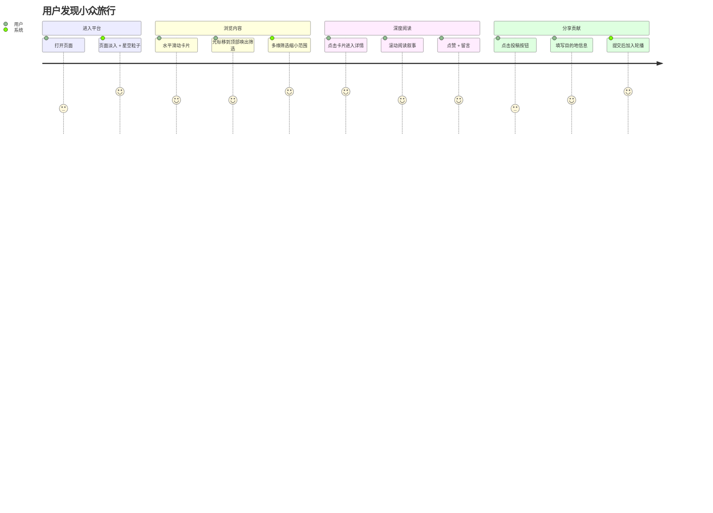

# PRD — 飞猪「100种不可思议旅行」内容展示 MVP

> 版本：v1.0 | 日期：2026-06-08 | 状态：已发布

---

## 1. 产品概述

**品牌归属**：飞猪旅行旗下子品牌「100种不可思议旅行」

**一句话定位**：为 Z 世代追求个性化旅行方式的用户提供沉浸式灵感发现平台。

**核心差异**：拒绝同质化攻略，以视觉氛围与情绪共鸣驱动旅行灵感发现。

---

## 2. 市场背景 & 用户痛点

| 痛点 | 现状 | 本产品方案 |
|---|---|---|
| 同质化严重 | 主流平台推荐算法导致"千人一面"，大理丽江重复刷屏 | 策展式内容 + 多维情绪筛选 |
| 发现效率低 | 小众目的地散落各处，用户需跨平台搜索 | 集中式灵感画布，一键浏览 |
| 情绪共鸣缺失 | 传统 OTA 以价格/评分排序，缺乏情感连接 | 情绪标签 + 氛围视觉 + 背景音乐 |
| 筛选维度单一 | 仅按目的地/价格筛选 | 按类型 × 情绪 × 预算三维交叉筛选 |

---

## 3. 用户画像

- **年龄**：18-28 岁
- **特征**：视觉内容消费者、追求个性表达、社交媒体活跃
- **行为**：在小红书/抖音发现旅行灵感 → 去飞猪预订
- **需求**：找到能"代表自己"的独特旅行方式

---

## 4. 核心功能

### 4.1 浏览页（P0）

- 水平流动轮播（BanG Dream embla 风格）
- 多维筛选：类型（多选）、情绪、预算
- 有机 blob 形态卡片 + 漂移动画
- 粒子星芒背景
- 诗意计数器
- 背景音乐（五声音阶）
- 投稿入口

### 4.2 详情页（P0）

- 全屏 Hero 视差大图
- 分段叙事（IntersectionObserver 淡入）
- 氛围动态渐变（colorPalette 驱动）
- 左右滑动导航（键盘 + 鼠标）
- 点赞 + 评论区

### 4.3 社交功能（P1）

- 点赞（localStorage 持久化）
- 评论（localStorage 持久化）
- 用户投稿（localStorage 持久化）

---

## 5. 非功能需求

| 维度 | 要求 |
|---|---|
| 性能 | CSS-only 动画（GPU 合成层），零 JS 动画阻塞，构建产物 < 250KB gzipped |
| 可访问性 | prefers-reduced-motion 全局检测，键盘导航，语义化 ARIA |
| 响应式 | 四档断点：≤480 / 481-767 / 768-1199 / 1200+ |
| 浏览器 | Chrome 90+, Firefox 90+, Safari 15+, Edge 90+ |
| 可维护性 | TypeScript strict mode，多范式分层架构 |

---

## 6. 用户故事

---

## 7. 成功指标

| 指标 | 目标（MVP） |
|---|---|
| 页面加载时间 | < 2s（FCP） |
| 卡片的平均浏览深度 | ≥ 3 张卡片 |
| 详情页阅读完成率 | ≥ 40%（滚动至底部） |
| 互动率（点赞/评论） | ≥ 5% UV |
| 投稿率 | ≥ 1% UV |
